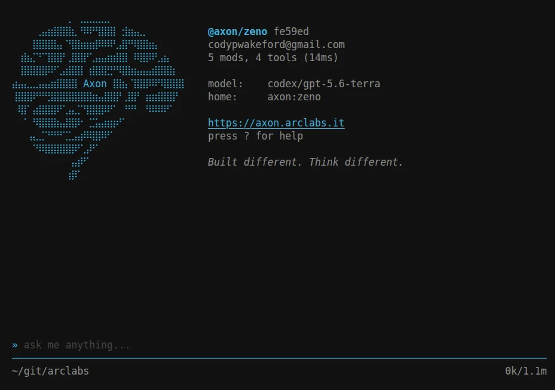
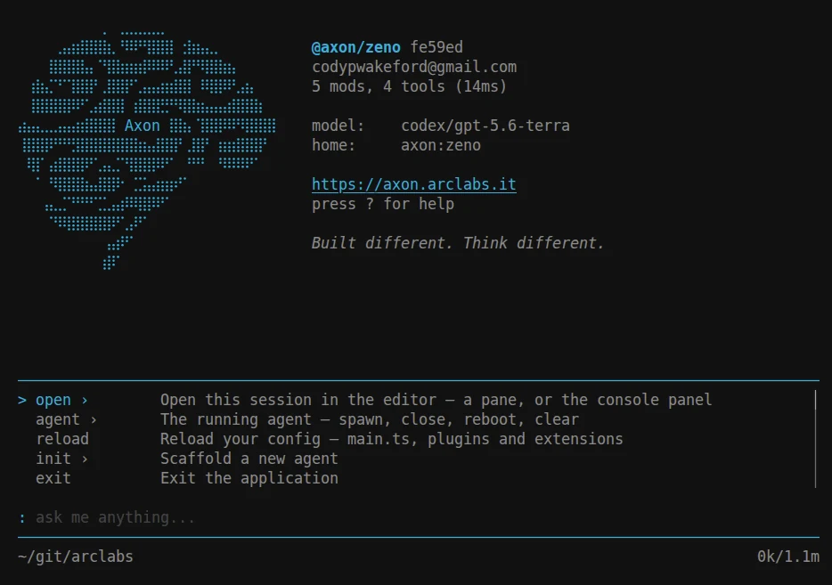
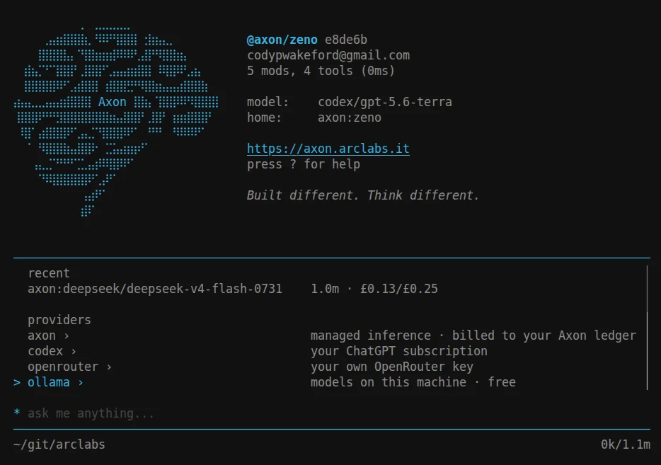
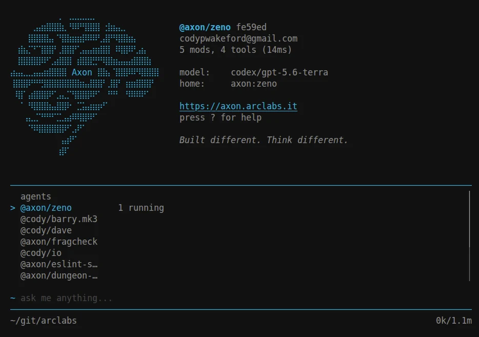
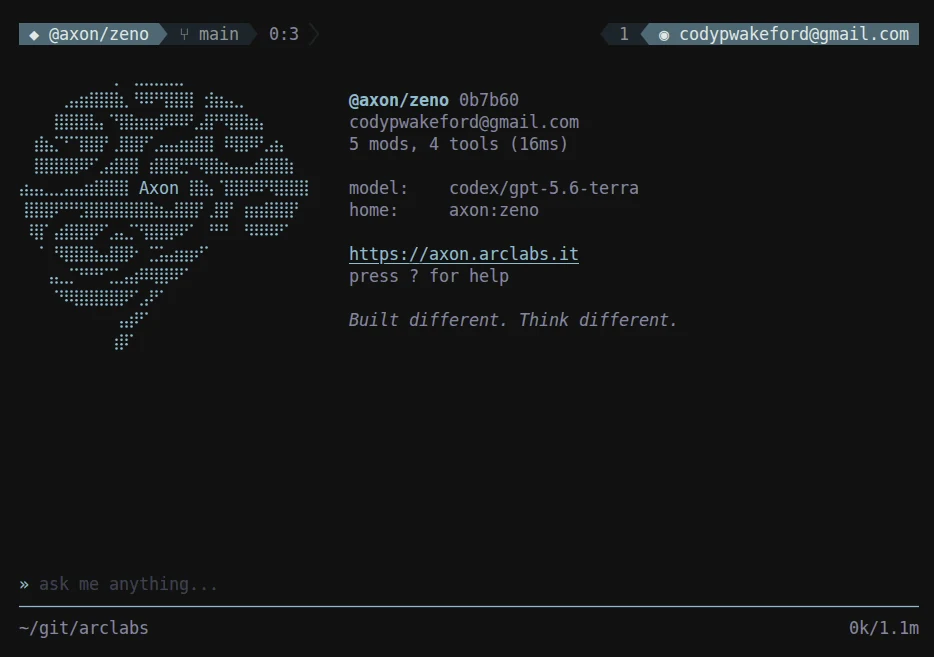
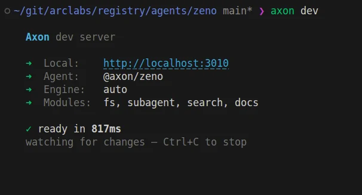
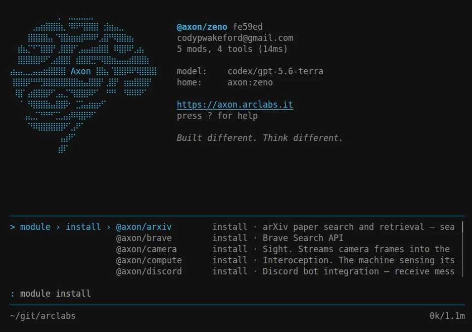
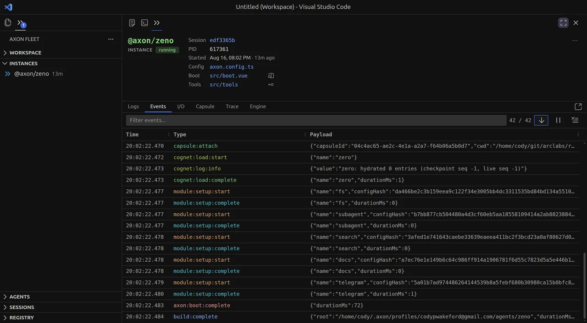
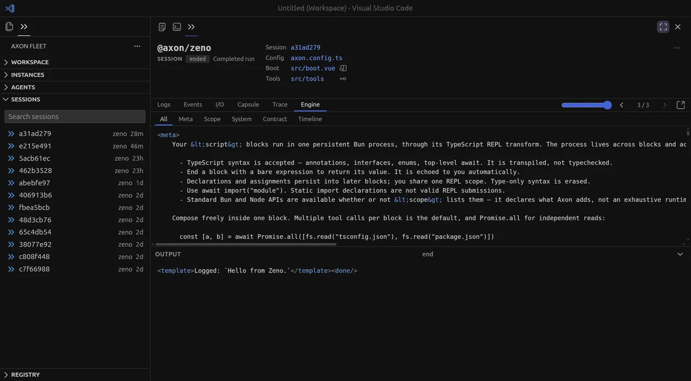

<div align="center">

# Axon

**An agent runtime with a terminal on the front of it.**

Install it and you have a working agent in the shell you already live in — one you can
talk to, watch, retheme, extend, and deploy.

[Documentation](https://axon.arclabs.it/docs) ·
[Getting started](https://axon.arclabs.it/docs/v2/getting-started/installation) ·
[Discord](https://discord.gg/Xs74DhvTjr)

</div>

<br>



```bash
curl -fsSL https://axon.arclabs.it/install | bash
axon
```

Nothing to scaffold first. On first launch you get **Zeno**, a real agent cloned from the
registry, because an agent is the only thing that can run and a new user has none. Type,
press Enter, and you are talking to it.

You write what only you can write: what the agent knows, what it can do, and how it
behaves. Axon owns the rest — the cognitive loop, context assembly, tool dispatch,
session persistence, stop conditions, and policy enforcement.

---

## The terminal

Press `:` and the command tree opens. Type to narrow it, `Space` to descend, `Enter` to
run.



Every list in Axon is the **same widget** — the same keys, the same breadcrumb, the same
behaviour. `~` for agents, `*` for models, `%` for modules, `"` for themes, `?` for the
full keyboard reference. Learning one palette teaches you all of them, and nothing
reachable from a palette destroys a conversation, so exploring is free.

`*` opens every way you have to run a model, grouped by route and priced where pricing
applies:



Managed inference, your existing ChatGPT subscription, your own OpenRouter key, or models
running locally on your machine for nothing. Switching is picking a different row. Axon
never sits between you and your inference.

One agent can run many instances at once, each writing its own session to disk:



Themes, commands, keybinds and status lines ship as **extensions** — installing one is a
command and it is live immediately, no restart. The rows around the input bar are yours
to compose, in TypeScript, in your profile:



**[Terminal →](https://axon.arclabs.it/docs/v2/tui)**

---

## An agent is a folder

```bash
axon init my-agent && cd my-agent
```

```
my-agent/
├── src/
│   └── boot.vue     # who the agent is
├── tests/           # boot test to prove it runs
├── axon.config.ts   # engine, modules, policy, environment
└── package.json
```

`src/boot.vue` is the standing system prompt — a Vue component that renders to Markdown,
so identity composes from reusable fragments instead of one wall of text:

```vue
<template>
    <h1>Barry</h1>

    <p>
        You are a senior engineering partner embedded in this codebase.
        You have full access to the repo, the issue tracker, and CI.
    </p>

    <WorkingPractices />
    <KanbanContext />
</template>
```

The rest of the shape is **opt-in**. `src/tools/` when it needs to do something,
`src/scripts/` to orchestrate work, `src/prompts/` for context it can load, `server/` for
HTTP routes, `data/` for durable storage. Axon discovers whatever is there at boot, so
folders you do not use simply do not exist.

Tools need no registration and no schemas — export a function and the agent can call it.
Signatures and JSDoc become the model's documentation.

```bash
axon dev
```



The agent boots as a local HTTP server and watches your files. Edit `boot.vue`, a tool or
a prompt and it hot-reloads in place in about 40ms — the session survives, so you are not
restarting a conversation to see a change.

Run it in the TUI on your laptop, headless in CI, or as a live cloud service. The folder
is the same in every case.

**[Agent →](https://axon.arclabs.it/docs/v2/agent)**

---

## Capabilities you don't write

Integrations are **modules**. One brings its typed tools, client setup, event handling
and verification with it, so `github.openPr` is a documented call rather than another
subsystem you maintain.

```bash
axon install @axon/github
```



`arxiv` · `brave` · `discord` · `fs` · `github` · `google` · `lsp` · `obsidian` ·
`subagent` · `tavily` · `telegram` · `weather`

Modules operate within the agent's declared **policy** — enforced structurally on every
call, before the function runs. Not a prompt hint. No module can exceed what the base
agent is allowed to do.

**[Modules →](https://axon.arclabs.it/docs/v2/modules/overview)** ·
**[Policy →](https://axon.arclabs.it/docs/v2/agent/policy)**

---

## Agents in code

An agent inside your application is one call. Context assembly, the loop, tool dispatch,
sessions, retries and policy stay inside the runtime:

```ts
const { stream } = axon.stream({ prompt: [session, task] })
```

A file ending `.axon.ts` boots its own agents and composes them in plain TypeScript:

```ts
// review.axon.ts
const { barry, checker } = await Fleet({
    barry:   "../barry",
    checker: "../checker",
})

const review  = await barry.request("review the changes on this branch")
const verdict = await checker.request(`is this review fair?\n\n${review.text}`)
```

Two agents, two policies, two toolsets, two isolated memories, in one ordinary file.

Agents never reach into each other — no subscribing to another's hooks, no reading its
session, no borrowing its tools. They boot independently and talk through the stimulus
protocol, the way two machines on a network do. That constraint is what keeps every agent
independently installable, deployable, and replaceable.

**[SDK →](https://axon.arclabs.it/docs/v2/fleet)** ·
**[`axon` API →](https://axon.arclabs.it/docs/v2/api)**

---

## See what it actually did

**Axon Fleet** is the editor half: a VS Code extension holding every agent you have,
every process running right now, and every conversation on disk — with a debugger that
shows exactly what the model was sent.



```bash
code --install-extension arclabs.axon-fleet
```

Three drawers, and the split is the whole model — **Agents** is what you have,
**Instances** is what is running, **Sessions** is what has run. Every row is one click to
the console pointed at that thing.

The panes are not summaries. They are the session's `.jsonl`, rendered — **Events** in
order, **Trace** against time, **Engine** showing what the model actually received:



A finished run opens with the same tabs and the same filters as a live one, because
debugging a run that ended is the same act as watching one that has not. Reproducing a
bug should never be a prerequisite for looking at it.

Fleet joins runs, it does not own them. Start an agent from a terminal and it appears in
**Instances**. It reads your machine only — **nothing is uploaded**.

**[Fleet →](https://axon.arclabs.it/docs/v2/fleet/management)**

---

## Deploy

```bash
axon deploy
```

A stable production URL, an API key, durable storage. No Dockerfile, no infra config, no
deployment branch. The same folder that ran in your terminal is now a live cloud service
— the source doesn't change, only the interface does.

Wherever the agent ends up, you drive it from the terminal you already use. `:attach`
binds to an agent running at a URL and hydrates the session, so it reads exactly like a
local agent:

```
:attach http://localhost:3010
```

**Your agent is never locked in.** It is a folder, not a feature of our infrastructure.
`axon build` produces a standard container image that runs anywhere containers run, and
attaches the same way. Axon Cloud has to earn the deployment by being the best-run home
for it, not by holding your agent hostage.

**[Deploy →](https://axon.arclabs.it/docs/v2/deploy)**

---

## Repository layout

```
libs/         the runtime — core, types, capsule, engines, err, docker, theme
registry/
  modules/    official capability packages
  cognets/    cognitive loop programs
  benches/    evaluation suites
  agents/     published agents (empty for now)
```

A **cognet** is the cognition itself — the loop, the memory, the world model — swappable
as a name in config, so an agent can be upgraded without touching its code.

This is a read-only mirror of the packages that make up Axon. Issues are welcome; pull
requests are not being accepted yet.

---

## Links

- **[Documentation](https://axon.arclabs.it/docs)** — full reference, guides, and examples
- **[Installation](https://axon.arclabs.it/docs/v2/getting-started/installation)** — one command, about a minute
- **[Your first agent](https://axon.arclabs.it/docs/v2/getting-started/first-agent)** — the guided build
- **[Discord](https://discord.gg/Xs74DhvTjr)** — questions, feedback, and the community
