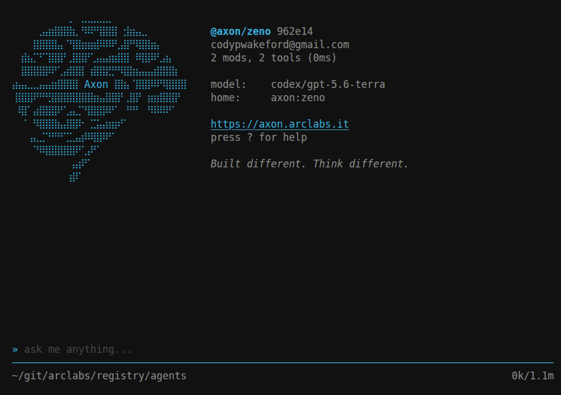

# @axon/zeno

Zeno is axon's default agent. He comes out of the box with the axon terminal. Packs only `@axon/fs` and `@axon/subagent` to get started and has knowledge of how to setup axon agents and build axon terminal extensions.

