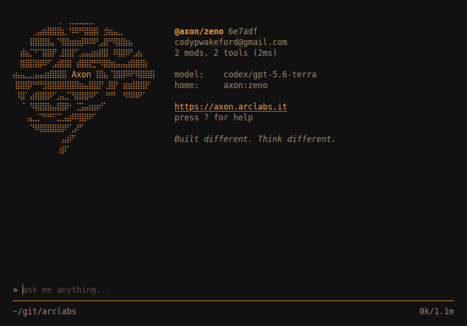
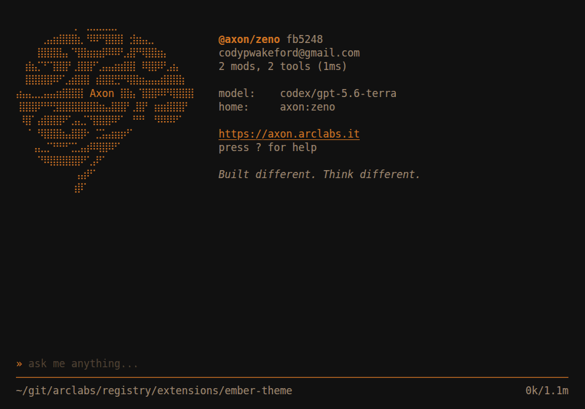
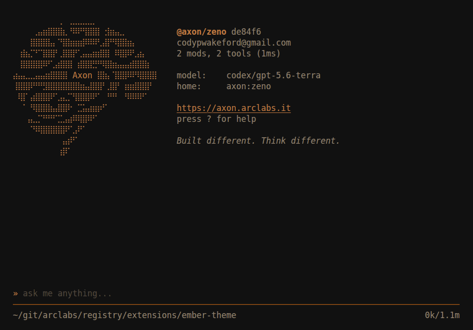

# @axon/ember-theme

A warm terminal palette for Axon, in three weights.

```bash
axon install @axon/ember-theme
```

**ember**
The default. Embers in the dark, mid-warmth.


**ember-dark**
The same fire further away — lower, deeper, quieter.


**ember-light**
Daylight. Inverted for a light terminal.
