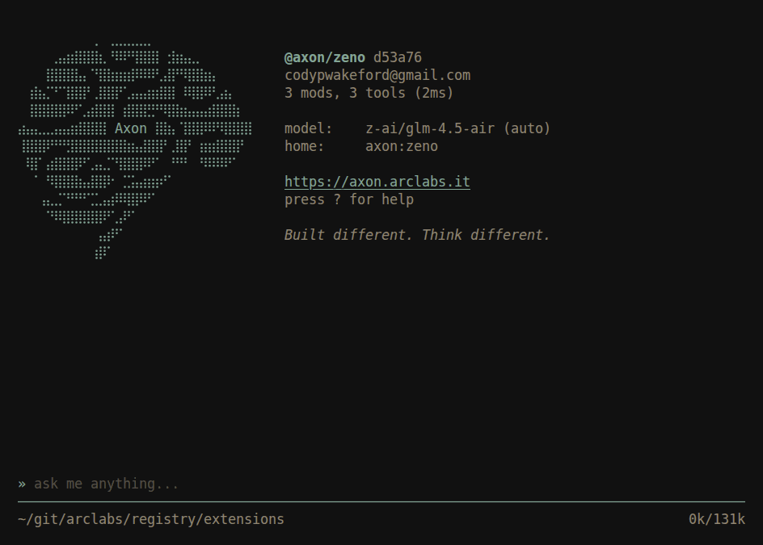
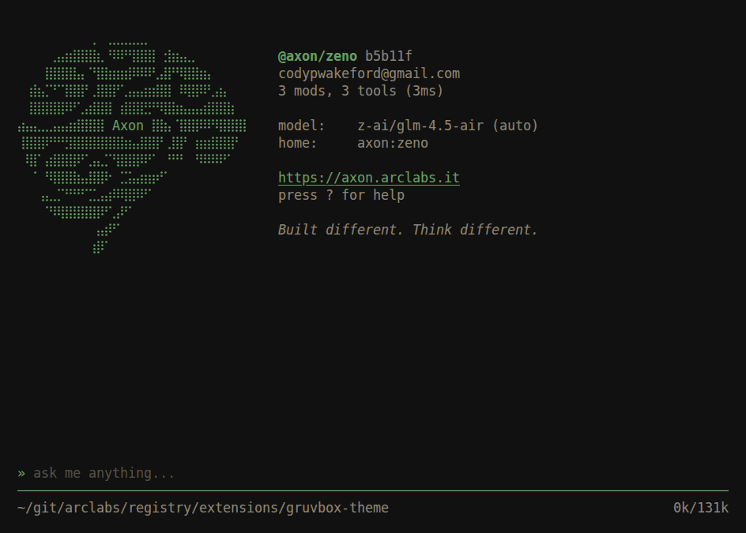
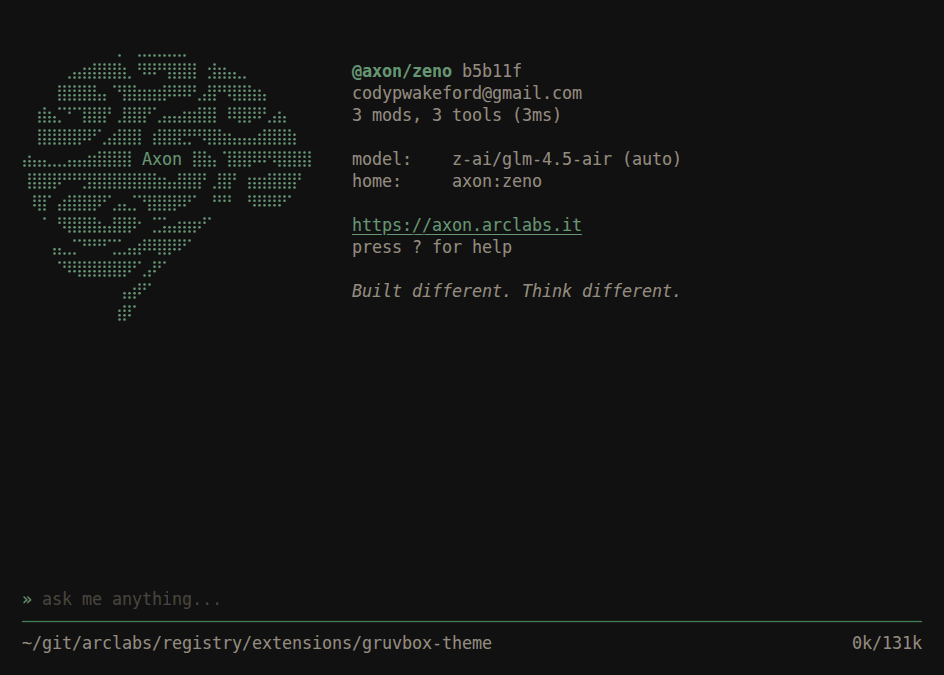

# @axon/gruvbox-theme

Retro groove for the terminal. Gruvbox in three weights.

```bash
axon install @axon/gruvbox-theme
```

**gruvbox**
The medium ground. Warm earth tones, transparent background.


**gruvbox-dark**
Hard contrast. The same palette pulled down for a near-black terminal.


**gruvbox-light**
The light side, for a light terminal.

