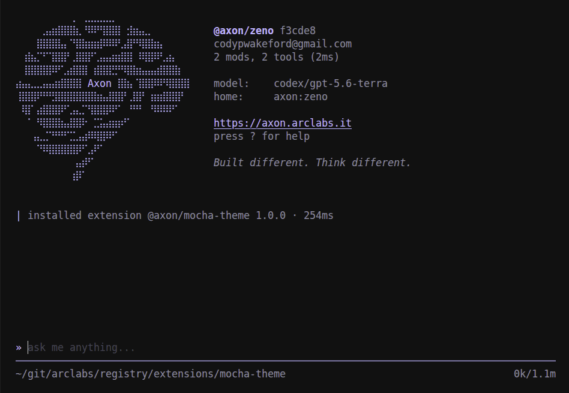
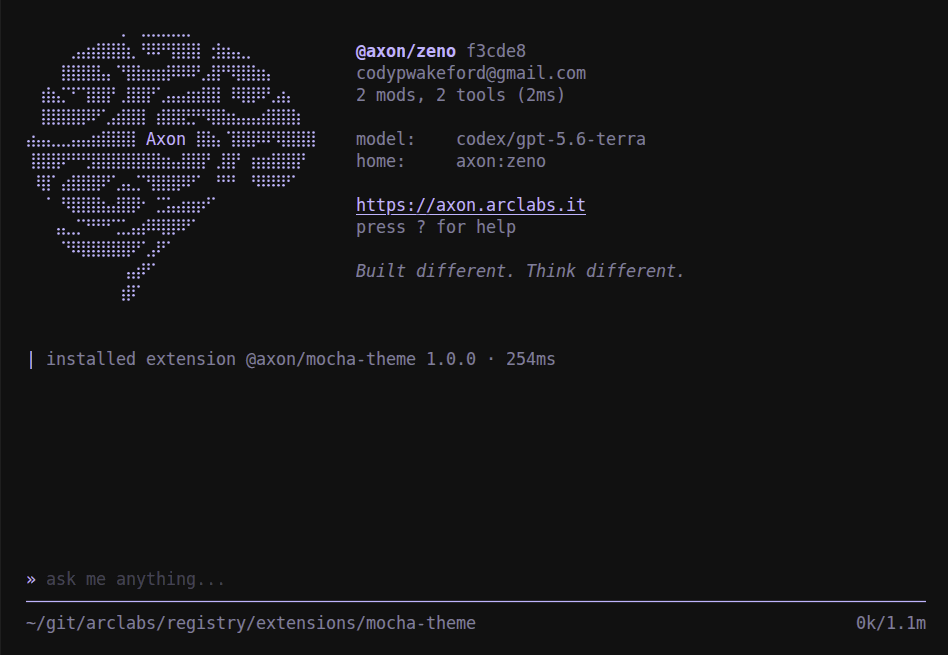
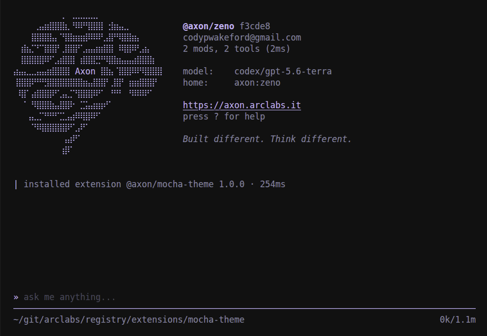
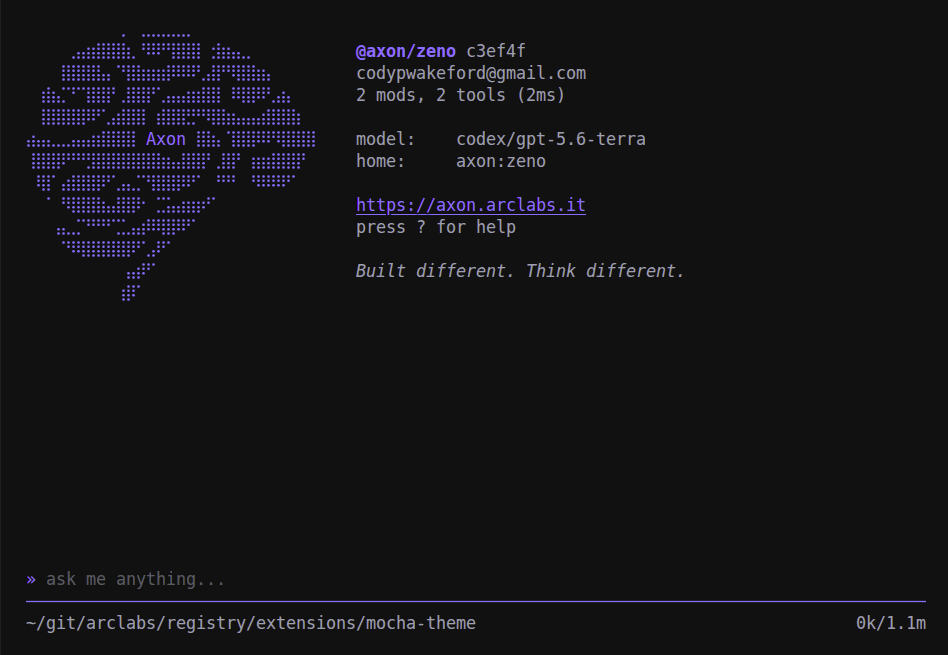

# @axon/mocha-theme

Catppuccin for the terminal. All four flavours.

```bash
axon install @axon/mocha-theme
```

**mocha**
The default. The darkest flavour, warm pastels on a dark ground.


**macchiato**
One step lighter. The same pastels, slightly softer contrast.


**frappe**
The most muted of the darks. For long sessions where mocha reads as too saturated.


**latte**
The light flavour, for a light terminal.

