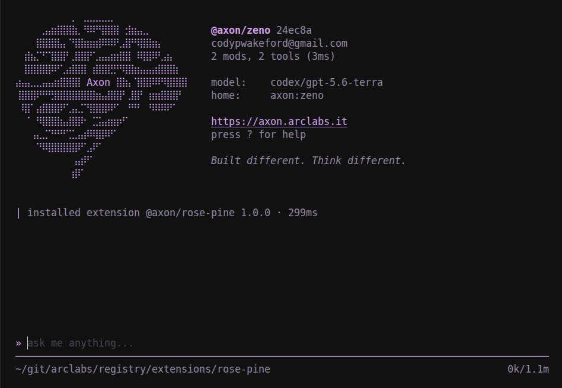
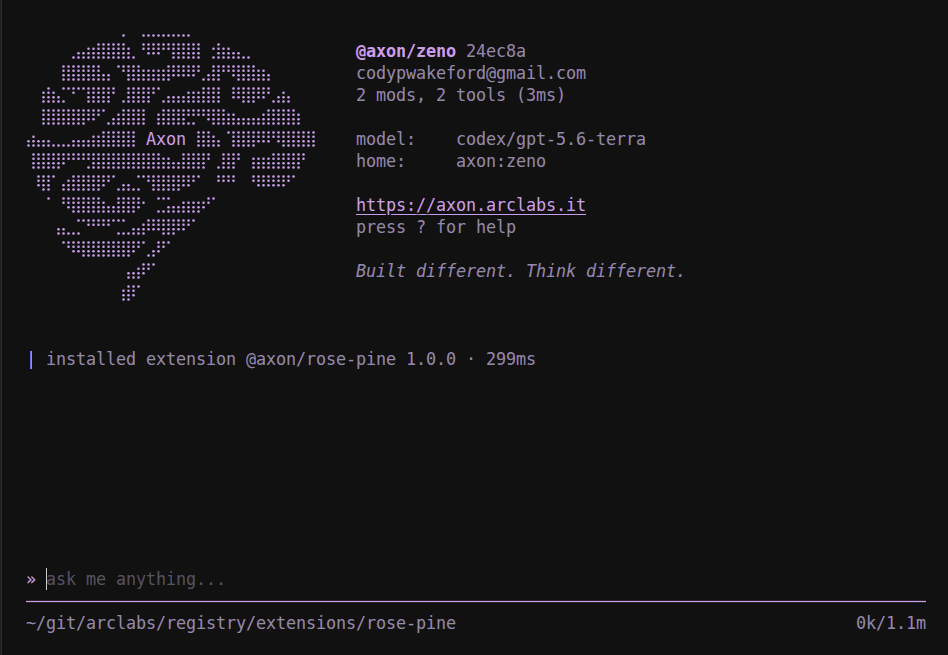
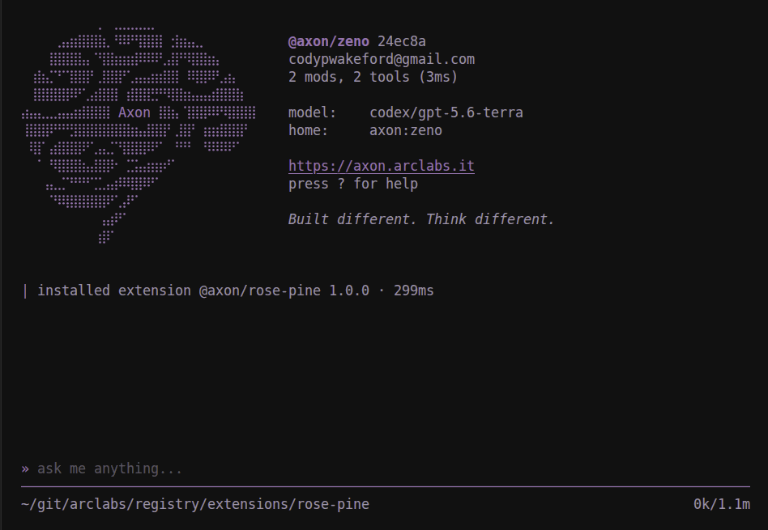

# @axon/rose-pine

Rosé Pine for the terminal. Muted rose and gold in three variants.

```bash
axon install @axon/rose-pine
```

**rose-pine**
The default. The original, over the darkest ground.


**rose-pine-moon**
A lighter, warmer dark. Softer contrast.


**rose-pine-dawn**
The light variant, for a light terminal.

