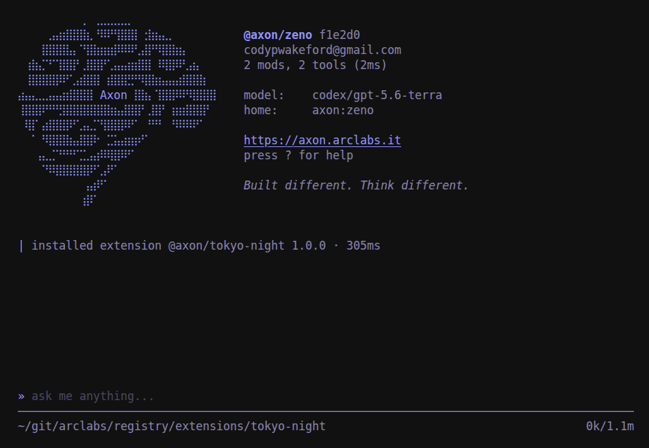
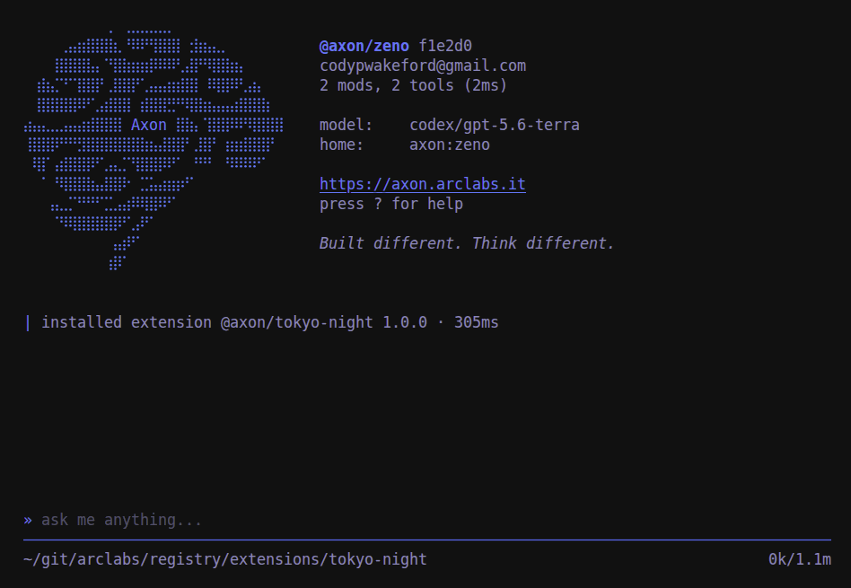

# @axon/tokyo-night

Tokyo Night for the terminal. Cool, high-contrast blues in three variants.

```bash
axon install @axon/tokyo-night
```

**tokyo-night**
The default. The darkest ground, the highest contrast.


**tokyo-night-storm**
The same palette over a lighter slate. Softer, less stark.


**tokyo-night-day**
The light variant, for a light terminal.

